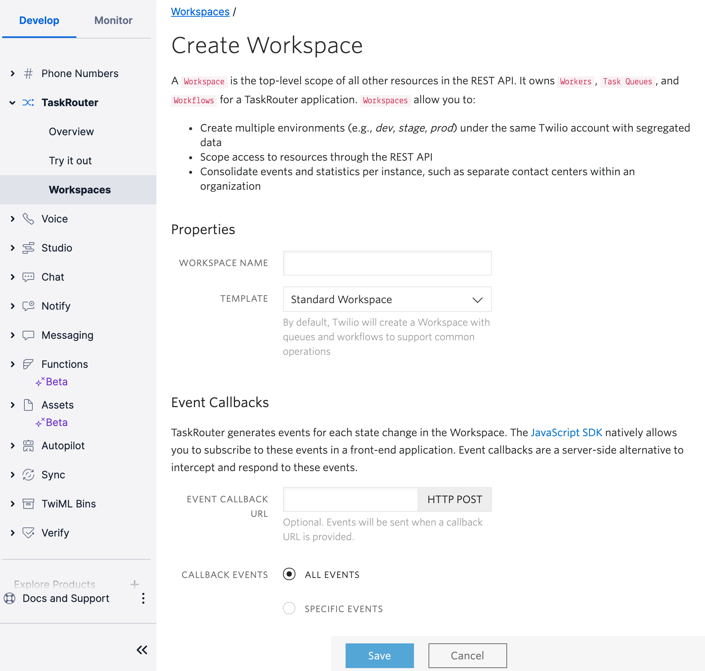
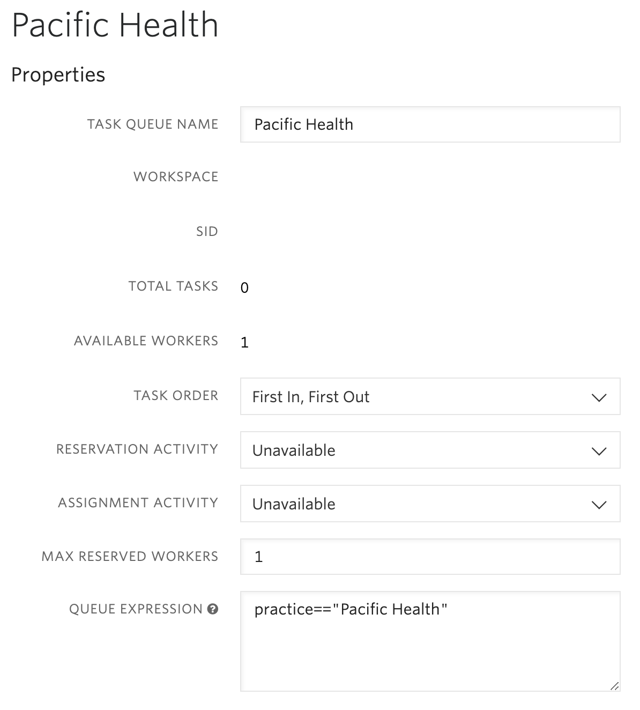

# Outbound Calling Example

## Use Case

Connect an incoming call to a Twilio Phone number to another phone number or Voice Client address.
An example may be if you want to dial to

## Twilio Technologies Used

- [Phone Numbers](https://www.twilio.com/docs/phone-numbers)
- [Studio](https://www.twilio.com/docs/studio)
- [Programmable Voice](https://www.twilio.com/docs/voice)
  - [API](https://www.twilio.com/docs/voice/api)
  - [TwiML](https://www.twilio.com/docs/voice/twiml)
  - [AMD (Answering Machine Detection)](https://www.twilio.com/docs/voice/answering-machine-detection)
- [TaskRouter](https://www.twilio.com/docs/taskrouter)
- [Serverless Functions (Node.js)](https://www.twilio.com/docs/runtime/functions)

## Instructions

### Overview

Using Twilio Studio, enqueue a call and create a Task in TaskRouter. Using TaskRouter Events, trigger an outbound call using the Programmable Voice API and Twilio Functions. The outbound call will include Answering Machine detection and a Status Callback URL. When the call connects us we'll use TwiML to dial the the queue and connect the calls.

### Step 1. Configure TaskRouter

1. [Create a TaskRouter Workspace](https://console.twilio.com/us1/develop/taskrouter/workspaces?frameUrl=%2Fconsole%2Ftaskrouter%2Fworkspaces%3Fx-target-region%3Dus1) in the Twilio Console.
   

   Give the Worspace a name and the value of the Event Callback field will be the URL to your `tr-event-handler.js` Function. i.e. `https://<TWILIO FUNCTION DOMAIN>/tr-event-handler`

   Click the Save button.

2. Create a TaskQueue - On the TaskRouter menu select TaskQueue and create a TaskQueue with the name of the business you're sending calls to. For this example we'll use a fictional health care practice called Pacific Health.
   

   TaskQueues are where TaskRouter Workers are held waiting to be assigned a Task. Note how the Queue Expression in the example above has the value `practice=="Pacific Health"`. This means any Worker with that value will be pulled into this specific TaskQueue.

3. Create a Worker -

### Create a Studio IVR

Use Twilio Studio to create an IVR. You can find a tutorial here: <https://www.twilio.com/docs/studio/tutorials/how-to-build-an-ivr>

In the IVR we'll want to use the [Enqueue Call](https://www.twilio.com/docs/studio/widget-library/enqueue-call) widget
